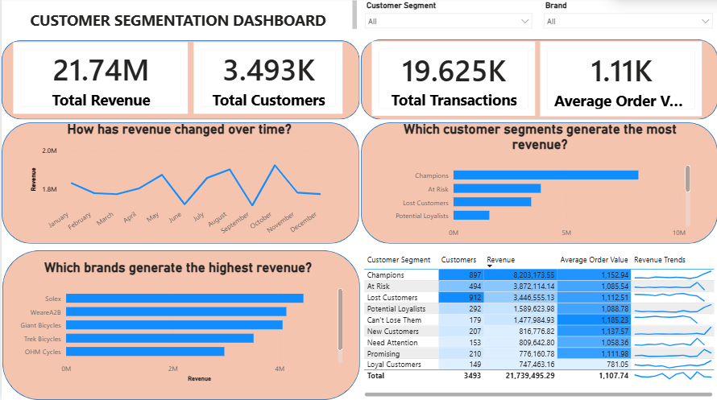

# Customer Segmentation Analysis
### Customer Segmentation Dashboard

<p align="center">
  
</p>

## Project Overview

This project develops an end-to-end customer segmentation solution using customer demographic, transaction, customer address, and new customer data. The project follows a complete data analytics workflow, including data quality assessment, data cleaning, SQL analysis, exploratory data analysis (EDA), RFM (Recency, Frequency, Monetary) analysis, customer segmentation, and the development of an interactive Power BI dashboard to generate business insights and support data-driven decision-making.

The repository documents each stage of the project, from the original raw datasets through to the final analytical outputs.

---

## Objectives

The objectives of this project are to:

- Assess and improve the quality of customer data.
- Prepare reliable datasets for customer analytics.
- Explore customer purchasing behaviour through exploratory data analysis.
- Perform customer segmentation using the RFM framework.
- Develop an interactive Power BI dashboard for business reporting.
- Generate actionable insights to support customer engagement and marketing strategies.

---

## Dataset

The project uses four datasets:

- **Transactions** – Customer purchase transactions.
- **CustomerDemographic** – Customer demographic information.
- **CustomerAddress** – Customer address information.
- **NewCustomerList** – Information about prospective customers.

Both the original datasets and cleaned datasets are included in this repository to document the complete data preparation process.

---

# Project Workflow

```
Raw Data
    ↓
Data Quality Assessment
    ↓
Data Cleaning
    ↓
SQL Analysis
    ↓
Exploratory Data Analysis (EDA)
    ↓
RFM Analysis
    ↓
Customer Segmentation
    ↓
Power BI Dashboard
    ↓
Business Insights
```

---

# 1. Data Quality Assessment and Data Cleaning

Each dataset was individually assessed before cleaning. Data quality issues were identified and addressed to improve consistency, accuracy, and usability for customer segmentation analysis.

## CustomerDemographic

The following data preparation steps were completed:

- Removed variables that were not relevant to the customer segmentation analysis:
  - `first_name`
  - `last_name`
  - `DOB`
  - `deceased_indicator`
  - `default`
- Created a new **age** variable from the `DOB` column and removed the original `DOB` field.
- Standardised inconsistent values in the `gender` column:
  - `F` → `Female`
  - `Femal` → `Female`
  - `M` → `Male`
  - `U` → `Unknown`
- Removed records containing missing values where appropriate.
- Verified that no duplicate records were present.
- Retained only the variables relevant to customer segmentation:
  - `customer_id`
  - `gender`
  - `past_3_years_bike_related_purchases`
  - `job_title`
  - `job_industry_category`
  - `wealth_segment`
  - `owns_car`
  - `tenure`
  - `age`

---

## NewCustomerList

The following data preparation steps were completed:

- Removed variables that were not required for the analysis:
  - `first_name`
  - `last_name`
  - `DOB`
  - `deceased_indicator`
  - `address`
  - `Rank`
  - `Value`
- Created a new **age** variable from the `DOB` column and removed the original `DOB` field.
- Standardised inconsistent values in the `gender` column by converting `U` to `Unknown`.
- Removed records containing missing values where appropriate.
- Verified that no duplicate records were present.
- Retained variables relevant to customer demographics and customer location.

---

## Transactions

The following data preparation steps were completed:

- Removed unnecessary empty columns from the original dataset.
- Converted the `product_first_sold_date` column from integer format to a datetime format.
- Removed records containing missing values where appropriate.
- Verified that no duplicate records were present.
- Retained the variables required for transaction analysis.

---

## CustomerAddress

The following data preparation steps were completed:

- Removed the `country` column as it was not required for the analysis.
- Standardised inconsistent values in the `state` column:
  - `New South Wales` → `NSW`
  - `Victoria` → `VIC`
- Removed records containing missing values where appropriate.
- Verified that no duplicate records were present.
- Retained the variables required for customer location analysis:
  - `customer_id`
  - `address`
  - `postcode`
  - `state`
  - `property_valuation`

---

# 2. SQL Analysis

SQL was used to support data exploration, validation, and data preparation throughout the project. Queries were developed to demonstrate fundamental SQL skills and to assist with preparing the cleaned datasets for subsequent analysis and visualisation in Power BI.

The SQL analysis included activities such as:

- Retrieving and exploring customer and transaction data.
- Filtering and summarising records using aggregate functions.
- Joining multiple tables to create integrated datasets for analysis.
- Validating data consistency after the data cleaning process.
- Preparing structured datasets for exploratory analysis, RFM analysis, customer segmentation, and dashboard development.

The SQL scripts in this project demonstrate practical data manipulation and querying techniques commonly used in data analytics workflows.

---

# 3. Exploratory Data Analysis (EDA)

Exploratory Data Analysis (EDA) was conducted on each cleaned dataset to understand customer characteristics, purchasing behaviour, and geographical distribution before performing customer segmentation. The analysis combined descriptive statistics with data visualisation to identify patterns, assess variable distributions, and provide business context for the subsequent RFM analysis.

The EDA covered four datasets:

### Transactions
The transaction dataset was analysed to understand purchasing behaviour and sales activity. The analysis included:

- Transaction volume over time
- Monthly transaction distribution
- Day-of-week purchasing patterns
- Product pricing and profit distributions
- Product and brand frequency analysis

### Customer Demographic
The customer demographic dataset was explored to understand the characteristics of existing customers. The analysis included:

- Gender distribution
- Age distribution
- Past three years of bike-related purchases
- Customer tenure
- Wealth segment distribution
- Vehicle ownership
- Job industry categories
- Most common job titles

### Customer Address
The customer address dataset was analysed to examine customer location characteristics. The analysis included:

- Customer distribution by state
- Property valuation distribution
- Most common customer postcodes

### New Customer List
The prospective customer dataset was explored to understand the characteristics of potential customers. The analysis included:

- Gender distribution
- Age distribution
- Past three years of bike-related purchases
- Customer tenure
- Wealth segment distribution
- Vehicle ownership
- Job industry categories
- Job title distribution
- Geographic distribution by state and postcode
- Property valuation
- Correlation analysis between numerical variables

### Key Outcome

The exploratory data analysis provided a comprehensive understanding of customer demographics, purchasing behaviour, and geographic characteristics. These insights validated the quality of the cleaned datasets, highlighted important customer patterns, and established the analytical foundation for the RFM analysis, customer segmentation, and Power BI dashboard developed in the later stages of the project.
---

## 4. RFM Analysis

Recency, Frequency, and Monetary (RFM) analysis was conducted to quantify customer purchasing behaviour and establish a structured framework for customer segmentation. The analysis follows a complete analytical workflow, beginning with transaction validation, progressing through metric calculation and quartile-based scoring, and concluding with customer-level behavioural profiling.

### Data Preparation and Validation

The transaction dataset was first validated to ensure that the RFM analysis was based on reliable purchasing information. Validation procedures included:

- Verifying transaction completeness and data consistency.
- Confirming the observation period used for the analysis.
- Identifying the number of valid customers and transaction records.
- Retaining only approved transactions for customer value analysis.

These validation steps ensured that the calculated RFM metrics accurately reflected genuine customer purchasing behaviour.

### Calculate RFM Metrics

Customer purchasing behaviour was summarised using three quantitative metrics:

- **Recency (R)** – Number of days since the customer's most recent approved purchase, calculated using a snapshot date immediately following the latest transaction.
- **Frequency (F)** – Total number of approved purchase transactions completed by each customer during the observation period.
- **Monetary (M)** – Total purchase value accumulated by each customer based on approved transactions.

The three metrics were combined into a customer-level RFM table, where each row represents the purchasing history of an individual customer.

### Examine Metric Distributions

Before assigning customer scores, the distributions of the Recency, Frequency, and Monetary variables were examined to understand customer purchasing behaviour and assess the suitability of the scoring methodology.

This exploratory assessment provided insight into customer activity patterns and supported the use of quartile-based scoring.

### Quartile-Based RFM Scoring

Each customer was assigned a Recency, Frequency, and Monetary score ranging from **1 to 4** using quartile-based segmentation.

The scoring methodology follows the business interpretation of each metric:

- Customers with more recent purchases receive higher **Recency** scores.
- Customers who purchase more frequently receive higher **Frequency** scores.
- Customers with higher total spending receive higher **Monetary** scores.

The three scores were then combined to create an **RFM Code**, providing a compact representation of each customer's purchasing behaviour.

### RFM Code Analysis

The distribution of RFM Codes was analysed to understand the diversity of customer purchasing behaviours across the customer base.

Examining the frequency of different RFM Code combinations provided an intermediate analytical step before grouping customers into broader behavioural segments.

### Analytical Outcome

The completed RFM framework transformed individual transaction records into customer-level behavioural metrics that quantify purchasing recency, purchasing frequency, and customer value. This framework provides the foundation for behavioural customer segmentation and subsequent business analysis.

---

## 5. Customer Segmentation

Following the construction of the RFM framework, customers were classified into behavioural segments based on their Recency, Frequency, and Monetary scores. The objective of the segmentation was to transform customer purchasing behaviour into meaningful business groups that can support customer relationship management, targeted marketing, and strategic decision-making.

### Customer Segmentation Framework

Rather than interpreting hundreds of individual RFM Code combinations, customers were consolidated into broader behavioural segments using predefined business rules based on their RFM score profiles.

This approach simplifies customer analysis while preserving the underlying purchasing characteristics captured by the RFM model.

### Segment Validation

After customer segments were assigned, the segmentation framework was validated by comparing the average purchasing behaviour of customers within each segment.

The validation process examined:

- Average Recency
- Average Frequency
- Average Monetary value

This assessment confirmed that the behavioural characteristics of each segment aligned with the intended customer classification.

### Customer Distribution Analysis

The distribution of customers across all behavioural segments was analysed to understand the composition of the customer base.

This analysis identified the relative size of each segment and highlighted differences in customer engagement across the business.

### Revenue Contribution Analysis

Customer segments were further evaluated based on their contribution to total revenue.

Analysing revenue alongside customer distribution provides a more complete understanding of customer value by identifying segments that generate a disproportionate share of business revenue rather than simply containing the largest number of customers.

### Executive Customer Profile

The final stage of the analysis consolidated customer distribution, purchasing behaviour, and revenue contribution into an executive customer profile.

This summary provides a high-level overview of customer behaviour across all segments and serves as the analytical foundation for the interactive Power BI dashboard and subsequent business recommendations.

### Business Value

The customer segmentation framework enables organisations to move beyond transaction-level reporting by identifying customer groups with distinct behavioural characteristics. These insights support evidence-based decision-making for customer retention, loyalty initiatives, targeted marketing campaigns, customer reactivation strategies, and revenue optimisation.

---

## 6. Power BI Dashboard

The final stage of the project was the development of an interactive Power BI dashboard to translate the analytical outputs into a business reporting solution. The dashboard consolidates customer demographics, transaction history, RFM analysis, and customer segmentation into a single reporting interface, allowing users to monitor customer performance and explore purchasing behaviour through interactive visualisations.

### Customer Segmentation Dashboard

<p align="center">
  
</p>

### Dashboard Design

The dashboard was designed around three analytical objectives:

- Provide an executive summary of overall business performance.
- Evaluate customer value across behavioural segments.
- Enable interactive exploration of revenue performance through customer segmentation and product brands.

The report combines high-level KPIs with detailed analytical visualisations, allowing users to move from overall business performance to customer-level insights within a single dashboard.

### Dashboard Components

The dashboard consists of six integrated analytical views.

#### Executive KPIs

Four summary metrics provide an overview of business performance:

- Total Revenue
- Total Customers
- Total Transactions
- Average Order Value

These indicators provide an immediate summary of the customer base and overall sales performance.

#### Revenue Trend

A monthly revenue trend visualises changes in sales performance throughout the year, allowing seasonal fluctuations and revenue patterns to be identified.

#### Customer Segment Performance

Revenue generated by each customer segment is compared to identify which behavioural groups contribute the greatest business value.

This visual enables rapid comparison of customer value across the RFM segmentation framework.

#### Brand Performance

Revenue is analysed by product brand to identify the highest-performing brands and evaluate their contribution to overall sales.

#### Customer Segment Summary

A detailed summary table combines customer segmentation with key business metrics, including:

- Number of customers
- Total revenue
- Average order value
- Revenue trend indicator

This table provides both summary statistics and comparative performance across customer segments.

#### Interactive Filtering

The dashboard supports dynamic filtering through:

- Customer Segment
- Brand

These filters enable users to investigate customer behaviour for specific market segments or individual product brands without modifying the underlying analysis.

### Business Value

The dashboard transforms the analytical workflow into an interactive decision-support tool. Rather than reviewing separate datasets, notebooks, or statistical outputs, users can explore customer behaviour, evaluate segment performance, compare brand revenue, and monitor business performance within a single reporting environment.

The dashboard demonstrates how data preparation, exploratory analysis, RFM modelling, customer segmentation, and business intelligence reporting can be integrated into an end-to-end analytics solution that supports data-driven decision-making.
---

## 7. Business Insights

The project demonstrates an end-to-end customer analytics workflow, transforming raw transactional and customer data into actionable business insights through data preparation, exploratory analysis, RFM modelling, customer segmentation, and interactive business intelligence reporting.

The analysis identified meaningful differences in customer purchasing behaviour by evaluating customers across three dimensions: purchasing recency, purchasing frequency, and monetary value. Applying the RFM framework enabled customers with similar behavioural characteristics to be grouped into distinct segments, providing a more informative view of the customer base than analysing transaction data alone.

Key analytical outcomes include:

- Development of a customer-level RFM framework to quantify purchasing behaviour.
- Identification of behavioural customer segments using Recency, Frequency, and Monetary scores.
- Comparative analysis of customer value across different behavioural segments.
- Evaluation of revenue contribution by customer segment.
- Analysis of monthly revenue trends and product brand performance.
- Integration of analytical outputs into an interactive Power BI dashboard for business reporting.

Together, these analyses demonstrate how customer transaction data can be transformed into meaningful business intelligence that supports customer-centric decision-making.

### Potential Business Applications

The analytical framework developed in this project can support organisations in:

- Understanding customer purchasing behaviour through behavioural segmentation.
- Identifying high-value customer groups.
- Monitoring revenue performance across customer segments and product brands.
- Supporting customer retention and engagement initiatives using behavioural insights.
- Providing interactive reporting for operational and strategic decision-making.

Although this project was developed using a sample retail dataset, the analytical workflow is broadly applicable to customer analytics problems across retail, e-commerce, membership programs, financial services, and other customer-focused industries.

---

## Repository Structure

```
customer-segmentation-analysis/
│
├── data/
│   ├── raw/
│   │   └── Customer_Segmentation_Data.xlsx
│   │
│   └── cleaned/
│       ├── Customer_Segmentation_Data_Cleaned.xlsx
│       ├── Transactions_Cleaned.xlsx
│       ├── CustomerDemographic_Cleaned.xlsx
│       ├── CustomerAddress_Cleaned.xlsx
│       └── NewCustomerList_Cleaned.xlsx
│
├── 01_transactions_eda.ipynb
├── 02_customer_demographic_eda.ipynb
├── 03_customer_address_eda.ipynb
├── 04_new_customer_list_eda.ipynb
├── Customer_RFM_Analysis.ipynb
├── Customer_Segmentation_Dashboard.png
│
├── README.md
├── LICENSE
└── .gitignore
```

---

## Tools and Technologies

- **Microsoft Excel** – Initial data inspection and dataset management.
- **Python** – Data cleaning, exploratory data analysis (EDA), RFM analysis, customer segmentation, and data visualisation.
- **SQL** – Data validation, querying, and table integration to support analytical workflows.
- **Power BI** – Interactive dashboard development and business intelligence reporting.
- **Git & GitHub** – Version control, project documentation, and portfolio management.
